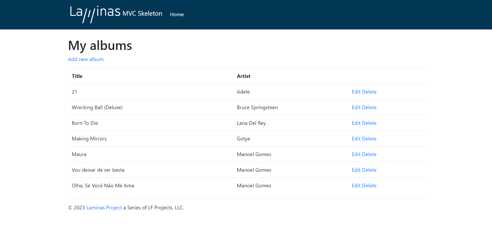

# Aplicação PHP com Laminas Project e Doctrine ORM Module

    

Aplicação Web em PHP com Laminas Project (Antigo Zend Framework) e Doctrine ORM Module.

## Ferramentas e Tecnologias

- HTML - Linguagem de Marcação;
- CSS - Folhas de Estilo;
- Bootstrap - Framework CSS;
- PHP - Linguagem de Programação;
- MySQL - Sistema de Gerenciamento de Banco de Dados;
- Laminas Project - Framework PHP;
- Doctrine ORM - Modulo Doctrine para mapeamento objeto-relacional;
- Composer - Gerenciamento de dependências.

<div align="center">
  
</div>

## laminas-mvc-skeleton

> ## 🇷🇺 Русским гражданам
>
> Мы, участники Laminas, родились и живем в разных странах. У многих из нас есть друзья, родственники и коллеги как в России, так и в Украине. Некоторые из нас родились в России. Некоторые из нас живут в России. У некоторых бабушки и дедушки сражались с фашистами во Второй мировой войне. Здесь никто не поддерживает фашизм.
>
> У одного из нас есть украинская родственница, которая спаслась из дома вместе с сыном. Поезд задержался из-за бомбежки на дороге впереди. У нас есть друзья, которые прячутся в бомбоубежищах. Мы с тревогой ждем весточки от них после воздушных налетов, которые беспорядочно наносят удары и попадают по больницам, школам, детским садам и домам. Мы не берем это из каких-либо СМИ. Мы наблюдаем это напрямую.
>
> Вы доверяете нам достаточно, чтоб использовать наши программы, и мы просим вас довериться нам вновь. Мы нуждаемся в помощи. Выходите и протестуйте против этой бесполезной войны. Остановите кровопролитие. Скажите "Нет войне!"
>
> ## 🇺🇸 To Citizens of Russia
>
> We at Laminas come from all over the world. Many of us have friends, family and colleagues in both Russia and Ukraine. Some of us were born in Russia. Some of us currently live in Russia. Some have grandparents who fought Nazis in World War II. Nobody here supports fascism.
>
> One team member has a Ukrainian relative who fled her home with her son. The train was delayed due to bombing on the road ahead. We have friends who are hiding in bomb shelters. We anxiously follow up on them after the air raids, which indiscriminately fire at hospitals, schools, kindergartens and houses. We're not taking this from any media. These are our actual experiences.
>
> You trust us enough to use our software. We ask that you trust us to say the truth on this. We need your help. Go out and protest this unnecessary war. Stop the bloodshed. Say "stop the war!"

## Introduction

This is a skeleton application using the Laminas MVC layer and module
systems. This application is meant to be used as a starting place for those
looking to get their feet wet with Laminas MVC.

## Installation using Composer

The easiest way to create a new Laminas MVC project is to use
[Composer](https://getcomposer.org/). If you don't have it already installed,
then please install as per the [documentation](https://getcomposer.org/doc/00-intro.md).

To create your new Laminas MVC project:

```bash
$ composer create-project -sdev laminas/laminas-mvc-skeleton path/to/install
```

Once installed, you can test it out immediately using PHP's built-in web server:

```bash
$ cd path/to/install
$ php -S 0.0.0.0:8080 -t public
# OR use the composer alias:
$ composer serve
```

This will start the cli-server on port 8080, and bind it to all network
interfaces. You can then visit the site at http://localhost:8080/

- which will bring up Laminas MVC Skeleton welcome page.

**Note:** The built-in CLI server is _for development only_.

## Development mode

The skeleton ships with [laminas-development-mode](https://github.com/laminas/laminas-development-mode)
by default, and provides three aliases for consuming the script it ships with:

```bash
$ composer development-enable  # enable development mode
$ composer development-disable # disable development mode
$ composer development-status  # whether or not development mode is enabled
```

You may provide development-only modules and bootstrap-level configuration in
`config/development.config.php.dist`, and development-only application
configuration in `config/autoload/development.local.php.dist`. Enabling
development mode will copy these files to versions removing the `.dist` suffix,
while disabling development mode will remove those copies.

Development mode is automatically enabled as part of the skeleton installation process.
After making changes to one of the above-mentioned `.dist` configuration files you will
either need to disable then enable development mode for the changes to take effect,
or manually make matching updates to the `.dist`-less copies of those files.

## Running Unit Tests

To run the supplied skeleton unit tests, you need to do one of the following:

- During initial project creation, select to install the MVC testing support.
- After initial project creation, install [laminas-test](https://docs.laminas.dev/laminas-test/):

  ```bash
  $ composer require --dev laminas/laminas-test
  ```

Once testing support is present, you can run the tests using:

```bash
$ ./vendor/bin/phpunit
```

If you need to make local modifications for the PHPUnit test setup, copy
`phpunit.xml.dist` to `phpunit.xml` and edit the new file; the latter has
precedence over the former when running tests, and is ignored by version
control. (If you want to make the modifications permanent, edit the
`phpunit.xml.dist` file.)

## Running Psalm Static Analysis

To run the supplied skeleton static analysis, you need to do one of the following:
It is recommended to install the test components from laminas (laminas/laminas-test),
as this is used in the tests supplied.

```bash
$ composer require --dev vimeo/psalm psalm/plugin-phpunit laminas/laminas-test
```

Once psalm support is present, you can run the static analysis using:

```bash
$ composer static-analysis
```

## Using Vagrant

This skeleton includes a `Vagrantfile` based on ubuntu 18.04 (bento box)
with configured Apache2 and PHP 7.3. Start it up using:

```bash
$ vagrant up
```

Once built, you can also run composer within the box. For example, the following
will install dependencies:

```bash
$ vagrant ssh -c 'composer install'
```

While this will update them:

```bash
$ vagrant ssh -c 'composer update'
```

While running, Vagrant maps your host port 8080 to port 80 on the virtual
machine; you can visit the site at http://localhost:8080/

> ### Vagrant and VirtualBox
>
> The vagrant image is based on bento/ubuntu-18.04. If you are using VirtualBox as
> a provider, you will need:
>
> - Vagrant 2.2.6 or later
> - VirtualBox 6.0.14 or later

For vagrant documentation, please refer to [vagrantup.com](https://www.vagrantup.com/)

## Using docker-compose

This skeleton provides a `docker-compose.yml` for use with
[docker-compose](https://docs.docker.com/compose/); it
uses the provided `Dockerfile` to build a docker image
for the `laminas` container created with `docker-compose`.

Build and start the image and container using:

```bash
$ docker-compose up -d --build
```

At this point, you can visit http://localhost:8080 to see the site running.

You can also run commands such as `composer` in the container. The container
environment is named "laminas" so you will pass that value to
`docker-compose run`:

```bash
$ docker-compose run laminas composer install
```

Some composer packages optionally use additional PHP extensions.  
The Dockerfile contains several commented-out commands
which enable some of the more popular php extensions.
For example, to install `pdo-pgsql` support for `laminas/laminas-db`
uncomment the lines:

```sh
# RUN apt-get install --yes libpq-dev \
#     && docker-php-ext-install pdo_pgsql
```

then re-run the `docker-compose up -d --build` line as above.

> You may also want to combine the various `apt-get` and `docker-php-ext-*`
> statements later to reduce the number of layers created by your image.

## Web server setup

### Apache setup

To setup apache, setup a virtual host to point to the public/ directory of the
project and you should be ready to go! It should look something like below:

```apache
<VirtualHost *:80>
    ServerName laminasapp.localhost
    DocumentRoot /path/to/laminasapp/public
    <Directory /path/to/laminasapp/public>
        DirectoryIndex index.php
        AllowOverride All
        Order allow,deny
        Allow from all
        <IfModule mod_authz_core.c>
        Require all granted
        </IfModule>
    </Directory>
</VirtualHost>
```

### Nginx setup

To setup nginx, open your `/path/to/nginx/nginx.conf` and add an
[include directive](http://nginx.org/en/docs/ngx_core_module.html#include) below
into `http` block if it does not already exist:

```nginx
http {
    # ...
    include sites-enabled/*.conf;
}
```

Create a virtual host configuration file for your project under `/path/to/nginx/sites-enabled/laminasapp.localhost.conf`
it should look something like below:

```nginx
server {
    listen       80;
    server_name  laminasapp.localhost;
    root         /path/to/laminasapp/public;

    location / {
        index index.php;
        try_files $uri $uri/ @php;
    }

    location @php {
        # Pass the PHP requests to FastCGI server (php-fpm) on 127.0.0.1:9000
        fastcgi_pass   127.0.0.1:9000;
        fastcgi_param  SCRIPT_FILENAME /path/to/laminasapp/public/index.php;
        include fastcgi_params;
    }
}
```

Restart the nginx, now you should be ready to go!

## QA Tools

The skeleton does not come with any QA tooling by default, but does ship with
configuration for each of:

- [phpcs](https://github.com/squizlabs/php_codesniffer)
- [laminas-test](https://docs.laminas.dev/laminas-test/)
- [phpunit](https://phpunit.de)

Additionally, it comes with some basic tests for the shipped
`Application\Controller\IndexController`.

If you want to add these QA tools, execute the following:

```bash
$ composer require --dev squizlabs/php_codesniffer laminas/laminas-test
```

We provide aliases for each of these tools in the Composer configuration:

```bash
# Run CS checks:
$ composer cs-check
# Fix CS errors:
$ composer cs-fix
# Run PHPUnit tests:
$ composer test
```
